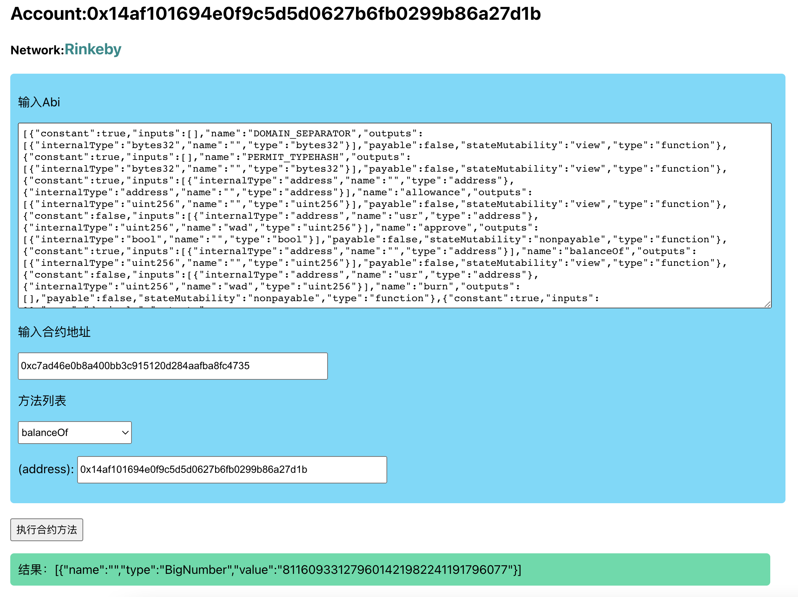

# 合约测试小能手

写合约 [0xe897f96867953673a2fd264b7003aA7dcD780e54 (rinkeby)](https://rinkeby.etherscan.io/address/0xe897f96867953673a2fd264b7003aa7dcd780e54#writeContract)


读合约 [0xc7ad46e0b8a400bb3c915120d284aafba8fc4735 (rinkeby dai-token)](https://rinkeby.etherscan.io/address/0xc7ad46e0b8a400bb3c915120d284aafba8fc4735#readContract)


读合约 [0xAc79cf53C72b47c1478D340D435e28907426D01E (Bsctest Garden)](https://testnet.bscscan.com/address/0xAc79cf53C72b47c1478D340D435e28907426D01E#code)


# 必要条件
* 安装 `Matemsk` 钱包扩展


# 安装项目依赖
```
npm install 

```
# 启动项目

```
npm start

# Open [http://localhost:3000](http://localhost:3000) 

```
# 开始交互
* 在`matemsk`钱包扩展选择好自己要测试的网络
* 将默认的ABI和合约地址换成你自己的
* 选择合约方法，根据情况填写参数
* 点击执行按钮会自动和 `Matemask`钱包扩展交互


